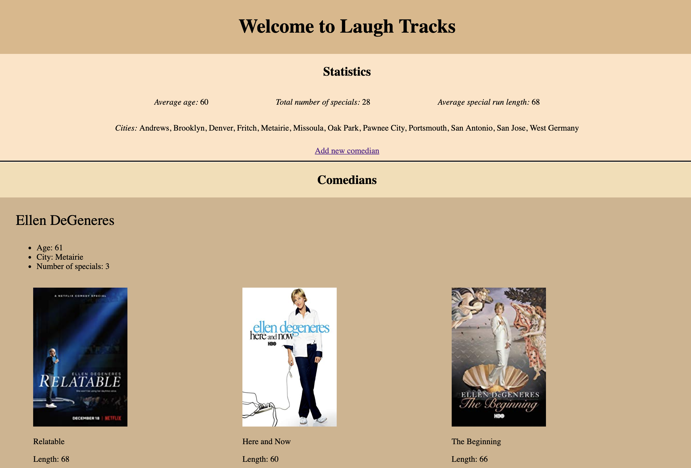
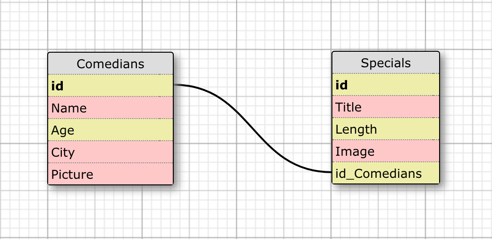

# README

Laugh Tracks is a solo project that is part of the Turing School of Sofware and
Design's Backend Engineering Module 2 curriculum.  The aim of the project is to
introduce students to database driven applications such as Ruby on Rails, and
to help students learn the concepts of MVC applications.

The project is an application that shows a listing of comedians, some pertinent
information about each comedian, and a listing of some television specials
featuring that comedian.  This index is the main part of the project.  There
is also a welcome/splash page, and a separate page that displays a form for a
user to enter information about a new comedian.  Logic was also included in the
application so that a user could query the list of comedians by age, using the
query section of the site URL.  

The pic below is a screen capture of the main index page.

The program can be ran in development from the Rails server.  In the command line, type `rails s`.  The terminal output will show
the IP address to type into the browser in order to see the project (for example, localhost:3000).  The production version of
the project is available at:

https://pure-river-20429.herokuapp.com/

This project was written in Ruby on Rails, version 5.1.6.1.  Postgresql version 11.1 is the database that is used for the project.

The database was created and migrations were used to set up the
tables.  The first table created was the Comedians table.  The
Specials table was then created.  A one-to-many relationship
exists between the tables (a comedian can have many specials).  
The migration for creating the Specials table was also used to
create the relationship to the Comedians table.  A third migration
was also performed, which simply altered the label of the Name column in the Specials table to Title. The database schema is shown below:

For this application, Minitest was disabled when the `rails new` command was issued.  RSpec was used in place of Minitest.  The gems Launchy and Capybara were used along with RSpec.  To run the test suite, type `rspec` in the command line at the root folder of the project.  This will run both the feature and model tests.

If there are any questions or comments about the project, please reach out to the author at stephensearl@hotmail.com.
